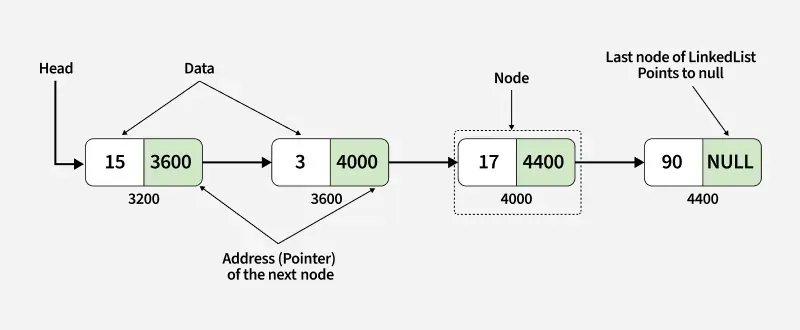
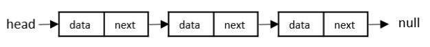
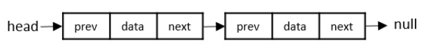
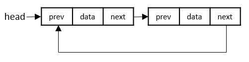

/*
A linked list is a linear data structure which can store a collection of "nodes" connected together via links i.e. pointers. Linked lists nodes are not stored at a contiguous location, rather they are linked using pointers to the different memory locations. A node consists of the data value and a pointer to the address of the next node within the linked list.

A linked list is a dynamic linear data structure whose memory size can be allocated or de-allocated at run time based on the operation insertion or deletion, this helps in using system memory efficiently. Linked lists can be used to implment various data structures like a stack, queue, graph, hash maps, etc.

A linked list starts with a head node which points to the first node. Every node consists of data which holds the actual data (value) associated with the node and a next pointer which holds the memory address of the next node in the linked list. The last node is called the tail node in the list which points to null indicating the end of the list.

A linked list consists of nodes with some sort of data, and a pointer, or link, to the next node.

- A linked list is a linear data structure that stores a collection of data elements dynamically.
- Nodes represent those data elements, and links or pointers connect each node.
- Each node consists of two fields, the information stored in a linked list and a pointer that stores the address of its next node.
- The last node contains null in its second field because it will point to no node.
- A linked list can grow and shrink its size, as per the requirement.
- It does not waste memory space.

A linked list is a linear data structure that includes a series of connected nodes. Here, each node stores the data and the address of the next node.

*/

### Linked List vs Array

In case of arrays, the size is given at the time of creation and so arrays are of fixed lenghth where as Linked lists are dynamic in size and any number of nodes can be added in the linked lists dynamically. An array can accommodate similar types of data types where as linked lists can store various nodes of different data types.

- Size Matters
  Arrays have a fixed size. You decide how many elements to store upfront, and that’s it. Linked lists, on the other hand, can grow or shrink as needed. You can easily add or remove nodes without worrying about the total size.
- Memory Allocation
  Arrays use contiguous memory, meaning all elements are stored in memory. This makes accessing elements fast. Linked lists use separate memory for each node, which can lead to some inefficiency because of the extra memory needed for pointers.
- Memory Usage
  Arrays are generally more memory-efficient since they don’t need extra pointers. Linked lists require more memory due to the pointers.

- Insertion and Deletion
  When inserting or deleting elements, arrays can be slow, taking O(n) time, especially if you’re working with elements in the middle or at the beginning. This is because you may need to shift other elements. Linked lists allow for quick insertions at the beginning (O(1)), but inserting at the end can take O(n) time if you don’t have a direct pointer to the last node.

- Searching for Elements
  Searching in arrays can take O(n) time in the worst case. If the array is sorted, you can use binary search, which is faster at O(log n). For linked lists, you also typically spend O(n) time searching since you need to traverse each node until you find what you’re looking for.

- Accessing Elements
  Accessing elements is quick in arrays, with a time complexity of O(1). You can jump directly to any index. In linked lists, accessing an element requires O(n) time because you need to follow the chain of nodes from the start.

- Deleting Elements
  In arrays, deleting an element from the beginning or middle can take O(n) time since other elements need to be shifted. However, deleting from the end can be done in O(1). For linked lists, removing a node at the beginning is O(1), but it takes O(n) to remove from the middle or end, as you have to find the node first.

- Best Use Cases
  Arrays work best when you know how many elements you'll need and require fast access, like storing pixel values in images. Linked lists are great for situations where you frequently add or remove elements, such as managing a list of users in a web application.

### Types of Linked List

- Singly Linked List

  - Singly linked lists contain two "buckets" in one node; one bucket holds the data and the other bucket holds the address of the next node of the list. Traversals can be done in one direction only.
    

- Doubly Linked List

  - Doubly Linked Lists contain three "buckets" in one node; one bucket holds the data and the other buckets hold the addresses of the previous and next nodes in the list. The list is traversed twice as the nodes in the list are connected to each other from both sides.
    

- Circular Linked List
  Circular linked lists can exist in both singly linked list and doubly linked list.

  Since the last node and the first node of the circular linked list are connected, the traversal in this linked list will go on forever until it is broken.
  

### Basic Operations in Linked List

- Insertion
- Deletion
- Display
- Search
- Delete

### Time and Space Complexity of Linked Lists

- Traversal

  - When you traverse a linked list, you visit each node. This takes O(n) time, where n is the number of nodes in the list.
  - However, you don’t need extra space for this operation, so the space complexity is O(1).

- Insertion at the Beginning
  - Inserting a node at the start is quick and straightforward. It takes O(1) time because you only need to change the head reference.
  - The space complexity is also O(1) since you aren’t using additional space.
- Insertion at the End
  - Adding a node at the end takes more time, specifically O(n), because you may need to go through the entire list to find the last node.
  - Still, the space complexity remains O(1) as you only need space for the new node.
- Deletion at the Beginning

  - Removing the first node is efficient, requiring O(1) time. You just update the head reference, and like the previous operations,
  - The space complexity is O(1).

- Deletion at the End
  - Deleting the last node takes O(n) time, similar to inserting at the end, since you need to traverse the list.
  - The space complexity stays O(1) since no extra space is needed beyond the operation.
