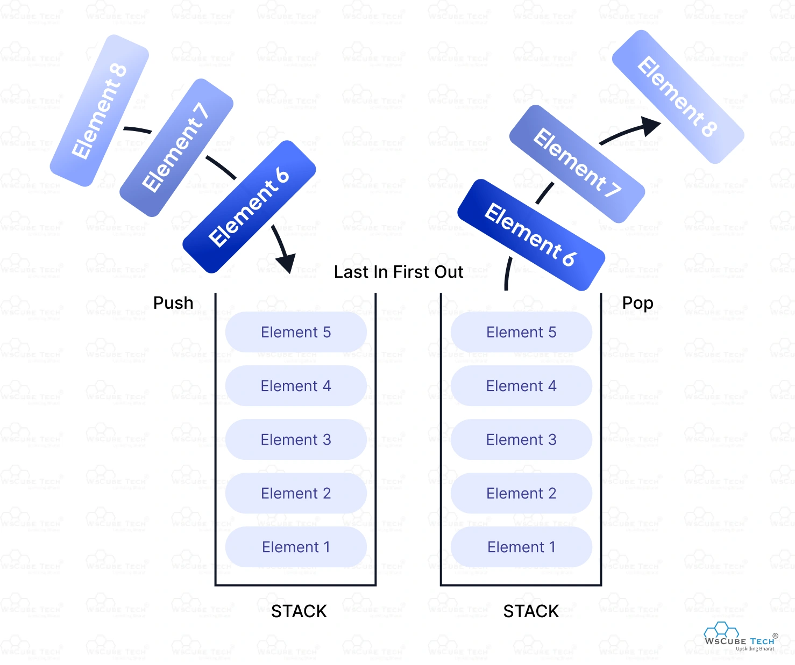

/*
Stack is a linear data structure that follows LIFO (Last In First Out) Principle, the last element inserted is the first to be popped out. It means both insertion and deletion operations happen at one end only.

Here are some real world examples of LIFO

- Consider a stack of plates. When we add a plate, we add at the top. When we remove, we remove from the top.
- A shuttlecock box (or any other box that is closed from one end) is another great real-world example of the LIFO (Last In, First Out) principle where do insertions and removals from the same end.

Types of Stack:
* Fixed Size Stack : As the name suggests, a fixed size stack has a fixed size and cannot grow or shrink dynamically. If the stack is full and an attempt is made to add an element to it, an overflow error occurs. If the stack is empty and an attempt is made to remove an element from it, an underflow error occurs.

* Dynamic Size Stack : A dynamic size stack can grow or shrink dynamically. When the stack is full, it automatically increases its size to accommodate the new element, and when the stack is empty, it decreases its size. This type of stack is implemented using a linked list, as it allows for easy resizing of the stack.

Basic Operations on Stack:
In order to make manipulations in a stack, there are certain operations provided to us.

push() to insert an element into the stack [time and space complexity = O(1)]
pop() to remove an element from the stack [time and space complexity = O(1)]
top() Returns the top element of the stack. [time and space complexity = O(1)]
isEmpty() returns true if stack is empty else false. [time and space complexity = O(1)]
isFull() returns true if the stack is full else false. [time and space complexity = O(1)]

Push Operation on Stack

-- Algorithm for Push Operation:

- Before pushing the element to the stack, we check if the stack is full .
- If the stack is full (top == capacity-1) , then Stack Overflows and we cannot insert the element to the stack.
- Otherwise, we increment the value of top by 1 (top = top + 1) and the new value is inserted at top position .
- The elements can be pushed into the stack till we reach the capacity of the stack.

Pop Operation in Stack

Algorithm for Pop Operation:

- Before popping the element from the stack, we check if the stack is empty .
- If the stack is empty (top == -1), then Stack Underflows and we cannot remove any element from the stack.
- Otherwise, we store the value at top, decrement the value of top by 1 (top = top - 1) and return the stored top value.

Top or Peek Operation on Stack
Algorithm for Top Operation:

- Before returning the top element from the stack, we check if the stack is empty.
- If the stack is empty (top == -1), we simply print "Stack is empty".
- Otherwise, we return the element stored at index = top .

isEmpty Operation in Stack Data Structure:

Algorithm for isEmpty Operation:

- Check for the value of top in stack.
- If (top == -1), then the stack is empty so return true .
- Otherwise, the stack is not empty so return false .

isFull Operation in Stack Data Structure:

Algorithm for isFull Operation:

- Check for the value of top in stack.
- If (top == capacity-1), then the stack is full so return true.
- Otherwise, the stack is not full so return false.

Applications of Stack Data Structure
Although stack is a simple data structure to implement, it is very powerful. The most common uses of a stack are:

- To reverse a word - Put all the letters in a stack and pop them out. Because of the LIFO order of stack, you will get the letters in reverse order.
- In compilers - Compilers use the stack to calculate the value of expressions like 2 + 4 / 5 * (7 - 9) by converting the expression to prefix or postfix form.
- In browsers - The back button in a browser saves all the URLs you have visited previously in a stack. Each time you visit a new page, it is added on top of the stack. When you press the back button, the current URL is removed from the stack, and the previous URL is accessed.
*/
